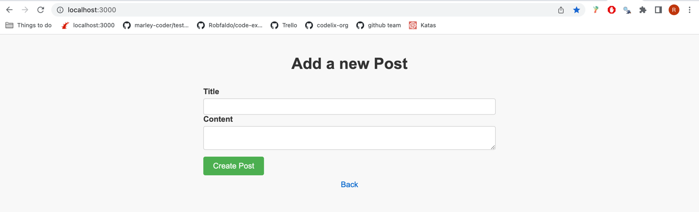
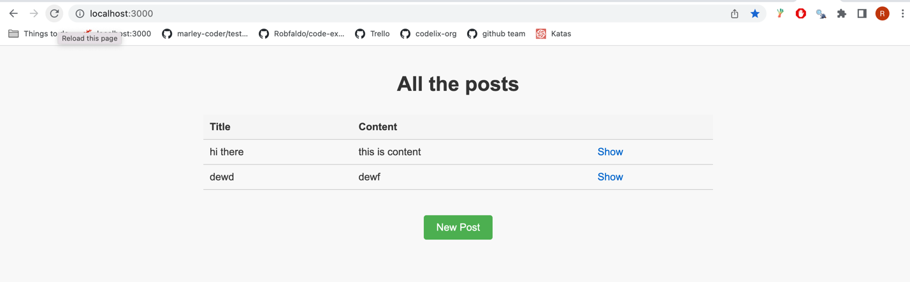

# Rails Trail - Exercise #1

## Getting started

```
# Navigate to the trail folder
mkdir rails-trail
cd rails-trail

# Clone this repo
git clone git@github.com:codelix-org/set-home-page.git
cd set-home-page

# Install dependencies
bundle 

# set up database
bundle exec rails db:create
bundle exec rails db:migrate

# create branch
git checkout -b attempt-YOURNAMEHERE

# run specs to see failing spec
bundle exec rspec

# run server 
bundle exec rails s
```

## Exercise instructions

In this exercise you'll be changing the page that loads when you visit the homepage. 

Currently when you go to http://localhost:3000/ you'll see this page:



Your challenge is to change the home page so that we can see all the posts that have been added, which 
feels more appropriate for our users to see when they load our site: 



You **SHOULD NOT** change any `html.erb` files. 

When you've completed the task, push your branch to github and create a PR for the branch.

## Marking this exercise

This exercise is marked automatically by a github action. When you create a PR (or push commits to an opened PR) it will run the specs, and if they pass it will send a notification to Codelix to notify you have passed the exercise.

You should see this updated fairly quickly in www.codelix.co.uk but if you don't you can check the Actions tab in this repo to see if the action failed and reach out to @Robfaldo for help.
